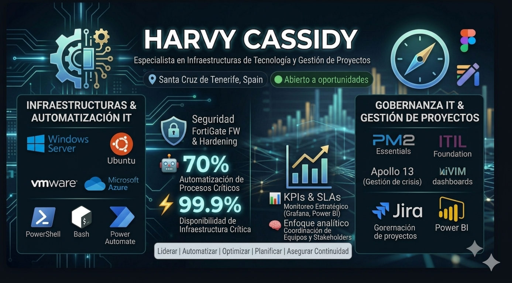

  

# Harvy Cassidy

### Especialista en Administración de Sistemas en Red  

Infraestructura IT | Seguridad | Automatización  

📍 España | 🔓 Abierto a oportunidades  

---

## 🧠 Propuesta de Valor

Administrador de Sistemas Informáticos en Red especializado en infraestructuras on-premise e híbridas (Microsoft/Linux) y virtualización (VMware/Hyper-V). Experto en la optimización operativa mediante la automatización de procesos con PowerShell, Bash y Power Automate.

Gracias a mi formación en gestión de proyectos (PM2) y de servicios (ITIL), aporto una visión integral en la planificación, ejecución y seguridad de entornos TI. Poseo un perfil autodidacta y resolutivo, orientado a la mejora continua y a la integración de la IA para maximizar la eficiencia tecnológica.

Mi enfoque se basa en cuatro pilares:

- ⚙️ **Automatización** → reducir carga operativa y errores humanos  

- 🔐 **Seguridad** → proteger infraestructura y datos críticos  

- 📊 **Optimización** → mejorar rendimiento y disponibilidad  

- 📋 **Gestión de proyectos IT** → planificación, ejecución y seguimiento mediante KPIs, SLAs y metodologías ágiles  

---

## 🚀 Impacto Real en Negocio

- 📈 Disponibilidad de sistemas críticos superior al **99.9%**

- ⚙️ Reducción de tareas manuales en más de **70%**

- ⚡ Disminución del tiempo de respuesta a incidencias en **60%**

- 🔍 Reducción del MTTD en un **40%** mediante monitorización avanzada

- 🤖 Automatización de procesos clave liberando **20% de capacidad operativa**

- 👥 Liderazgo de equipo técnico de **7 especialistas**

---

## 🧩 Especialización Técnica

### 💻 Sistemas Operativos

- Windows Server

- Linux (Ubuntu)

---

### 🌐 Redes y Seguridad

- VLANs, VPNs, DNS, DHCP, NAT, SSH

- Firewalls, Routers, Switches

- Seguridad perimetral

- Hardening

---

### 🖥️ Infraestructura y Servicios Microsoft

**Directory Services & Identidad**

- Active Directory

- Active Directory Federation Services (ADFS)

- Gestión de GPOs (Group Policy Objects)

**Virtualización y Plataformas**

- VMware

- Hyper-V

- Entornos on-premise e híbridos

**Alta Disponibilidad y Continuidad**

- Failover Clustering

**Publicación de Aplicaciones**

- RemoteApp

- Web Server (IIS)

- Hosting de aplicaciones web y servicios FTP

**Gestión y Actualización**

- Windows Server Update Services (WSUS)

---

### ⚙️ Automatización

- PowerShell

- Bash

- Power Automate

---

### 📊 Monitorización

- Grafana

- Check_MK

- Power BI

---

### 🗄️ Bases de Datos

- SQL Server

- MySQL

- MariaDB

---

### 🧠 Gestión de Proyectos, Crisis y Calidad 

- Metodología PM2

- Simulación de crisis (Apollo 13)

- ITIL Foundation

- Gestión de SLAs

- Planificación estratégica TI

---

### 🛠️ Gestión de Servicios 

- ServiceNow

- GLPI

- Microsoft Dynamics

---

### 🗄️ Almacenamiento y SAN

- Dell EMC (SAN)

- TrueNAS

---

### 🧾 SAP Basis | [Intermedio]

- Gestión de usuarios y roles

- Transportes

- Certificados

---

## 🏗️ Proyectos Estratégicos

### 🔒 Migración y Modernización de Infraestructura Crítica

**Problema:** Infraestructura legacy con riesgos de seguridad, configuraciones no estandarizadas y alta criticidad operativa.  

**Acción:**

- Lideré la virtualización del ERP SAP en entorno productivo.  

- Migración de sistemas on-premise de alto riesgo a infraestructura moderna.  

- Migración de firewalls FortiGate sin interrupciones.  

- Rediseño de políticas de seguridad y segmentación de red.  

**Resultado:**

- Continuidad operativa sin impacto en negocio.  

- Reducción de superficie de ataque.  

- Mejora significativa en seguridad perimetral.  

- Infraestructura más resiliente y escalable.  

---

### 🤖 Automatización y Optimización Operativa

**Problema:** Alta carga de tareas manuales, procesos repetitivos y baja eficiencia operativa.  

**Acción:**

- Desarrollo de automatizaciones con PowerShell y Bash.  

- Optimización de procesos administrativos y operativos.  

- Implementación de soluciones basadas en IA para toma de decisiones, planificación de recursos, auditorías y resolución predictiva de incidencias.  

**Resultado:**

- Reducción de tareas manuales en más del **70%**.  

- Liberación del **20% de la capacidad del equipo**.  

- Mejora significativa en eficiencia operativa.  

---

### 📊 Monitorización Avanzada y Gestión de Incidencias

**Problema:** Detección tardía de incidencias y tiempos de respuesta elevados.  

**Acción:**

- Implementación de dashboards en Grafana y herramientas de monitorización avanzada.  

- Configuración de alertas proactivas.  

- Seguimiento mediante KPIs y SLAs.  

- Coordinación de equipo técnico (7 especialistas).  

**Resultado:**

- Reducción del MTTD en un **40%**.  

- Disminución del tiempo de respuesta en un **60%**.  

- SLA mantenido en **99.9% de uptime**.  

- Mayor estabilidad y resiliencia del sistema.  

---

## 🏗️ Metodología y Gobernanza TI

Mi enfoque profesional integra la agilidad operativa con el rigor de la gestión de proyectos para garantizar infraestructuras resilientes y alineadas con los objetivos de negocio:

* **Marcos de Trabajo & Agilidad**: Aplicación de **metodologías ágiles (Scrum/Kanban)** para la gestión eficiente del backlog técnico y **PM2 Essentials** para la gobernanza estructurada de proyectos complejos.

* **Cultura Data-Driven**: Especialista en la elaboración de cuadros de mando en **Grafana y Power BI** para el seguimiento de **KPIs críticos**, control de **SLAs** y reporte ejecutivo de avances, desviaciones y bloqueos.

* **Gestión del Conocimiento**: Liderazgo en la estandarización de activos mediante la creación y mejora de **políticas, procedimientos y documentación técnica** del departamento IT.

* **Comunicación Estratégica**: Experiencia transformando datos técnicos en *insights* accionables para la toma de decisiones y la optimización de recursos.

* **Mejora Continua (Kaizen)**: Enfoque proactivo orientado a resultados numéricos, detectando cuellos de botella y asegurando la culminación exitosa de cada fase del proyecto.

---

## 🎓 Formación y Certificaciones

- Técnico Superior en Administración de Sistemas en Red (ASIR)

- PM2 Essentials - TecnoFor

- Inteligencia Artificial Generativa - TecnoFor

- Apollo 13 (Gestión de crisis) - TecnoFor

- Microsoft Certified Professional (MCP ID: 3357452)

---

## 🌍 Idiomas

- Inglés — B2 (Intermedio alto)

---

## 📬 Contacto

- 💼 LinkedIn: https://www.linkedin.com/in/harvy-cassidy-8a69a296/

- 📧 Email: hgcassidy@gmail.com

- 📍 Ubicación: España

---

## ⚡ Disponibilidad

🟢 Abierto a oportunidades en:

- Administración de Sistemas  

- Infraestructura IT  

- Seguridad de Redes  

- Automatización  

- Monitorización  

---

### 💡 "Transformo infraestructuras IT en sistemas eficientes, seguros y automatizados"

